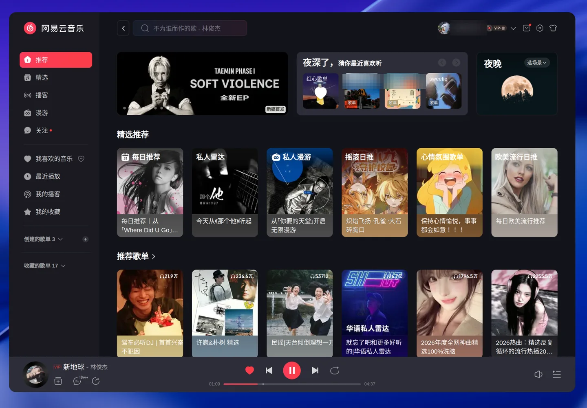
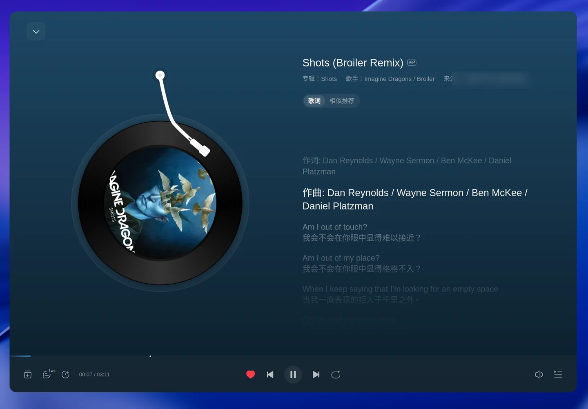
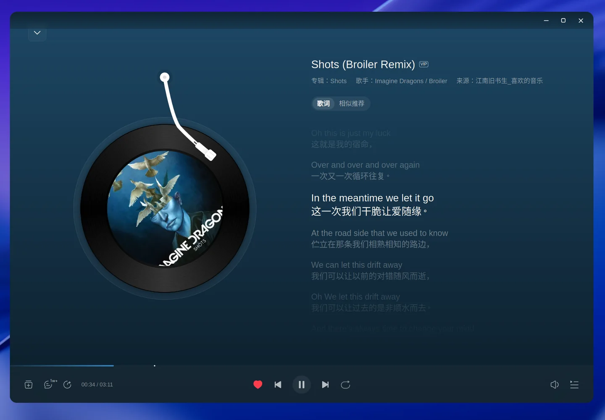

<div align="center">
  
  <h1>NetEase Music Shell</h1>
  <p>轻量、沉浸的网易云音乐 Linux 桌面壳</p>

  <p>
    <a href="https://github.com/Leon00x/netease-music-shell/releases/latest"></a>
    <a href="https://github.com/Leon00x/netease-music-shell/actions/workflows/release.yml"></a>
    <a href="LICENSE"></a>
    <a href="#系统要求"></a>
  </p>
</div>

NetEase Music Shell 使用 [Tauri 2](https://tauri.app/) 和系统 WebKitGTK，将
[网易云音乐 Web 播放器](https://music.163.com/st/webplayer) 封装成独立桌面应用。
它保留网页端完整功能，同时提供原生窗口、独立登录状态和系统媒体控制，无需 Electron。

## 界面预览

<p align="center">
  
</p>

<table>
  <tr>
    <td width="50%"></td>
    <td width="50%"></td>
  </tr>
  <tr>
    <td align="center">沉浸播放与歌词</td>
    <td align="center">顶部悬浮窗口控制栏</td>
  </tr>
</table>

## 功能

- 沉浸式无边框窗口，支持 16px 透明圆角
- 鼠标移至顶部即可显示窗口控制栏，支持拖拽、最小化、最大化与关闭
- 自动跟随网易云音乐深色与浅色主题
- 独立 WebKit 数据目录，持久保存登录状态
- 通过 MPRIS 集成桌面媒体面板、媒体键、歌曲信息与封面
- 支持 Wayland 和 X11
- 提供 Debian 安装包与 AppImage

## 安装

前往 [Releases](https://github.com/Leon00x/netease-music-shell/releases/latest) 下载最新版本。

| 格式 | 适用场景 | 使用方式 |
|---|---|---|
| `.deb` | Debian、Ubuntu 及其衍生发行版 | `sudo apt install ./NeteaseMusic_*_amd64.deb` |
| `.AppImage` | 其他主流 Linux 发行版 | 添加执行权限后直接运行 |

```bash
chmod +x NeteaseMusic_*_amd64.AppImage
./NeteaseMusic_*_amd64.AppImage
```

## 系统要求

- Linux x86_64
- WebKitGTK 4.1
- 支持透明窗口的桌面合成器

项目主要在 Ubuntu GNOME Wayland 环境中验证。其他基于 WebKitGTK 的桌面环境通常也可运行，
但窗口阴影、圆角抗锯齿和媒体面板外观可能因合成器而异。

## 从源码构建

### 1. 安装系统依赖

Ubuntu / Debian：

```bash
sudo apt install -y \
  libwebkit2gtk-4.1-dev \
  build-essential \
  curl wget file \
  libxdo-dev \
  libssl-dev \
  librsvg2-dev \
  pkg-config
```

Fedora：

```bash
sudo dnf install webkit2gtk4.1-devel gcc gcc-c++ make openssl-devel librsvg2-devel
```

Arch Linux：

```bash
sudo pacman -S webkit2gtk-4.1 base-devel librsvg
```

### 2. 准备工具链并构建

需要 Node.js 22+ 和 Rust 1.77+。

```bash
npm ci
npm run build
```

构建产物位于：

```text
src-tauri/target/release/netease-music
src-tauri/target/release/bundle/deb/
src-tauri/target/release/bundle/appimage/
```

启动开发版本：

```bash
npm run dev
```

## 实现概览

核心代码集中在 [`src-tauri/src/main.rs`](src-tauri/src/main.rs)：

- 使用 Chrome UA 通过站点浏览器兼容性检测
- 为 WebKitGTK 补充 `requestIdleCallback` polyfill
- 通过透明根背景和 `body` 裁剪实现圆角，不移动或扫描站点 DOM
- 仅向 `music.163.com` 开放窗口控制所需的最小 Tauri 权限
- 显式嵌入 PNG 窗口图标，保证窗口管理器获得正确图标

远程页面权限定义在
[`src-tauri/capabilities/netease-remote.json`](src-tauri/capabilities/netease-remote.json)。
更详细的维护背景见 [`docs/maintenance.md`](docs/maintenance.md)。

## 项目结构

```text
netease-music-shell/
├── .github/workflows/release.yml  # Release 自动构建
├── docs/                          # 截图与维护文档
├── src/                           # Tauri 前端占位目录
├── src-tauri/
│   ├── capabilities/              # 远程页面权限
│   ├── icons/                     # 应用图标
│   ├── src/main.rs                # 应用入口与窗口逻辑
│   ├── Cargo.toml
│   └── tauri.conf.json
├── package.json
├── CONTRIBUTING.md
├── SECURITY.md
└── README.md
```

## 故障排查

| 问题 | 处理方式 |
|---|---|
| NVIDIA / Wayland 下窗口空白 | 使用 `WEBKIT_DISABLE_DMABUF_RENDERER=1 netease-music` 启动 |
| 页面提示浏览器不兼容 | 确认运行的是本项目最新构建，而不是普通 WebKit 浏览器窗口 |
| 登录状态异常 | 退出应用后清理 `~/.local/share/com.leon.netease-music/` 并重新登录 |
| 桌面图标没有刷新 | 重新安装软件包，或清理桌面环境的图标缓存后重新登录 |

## 参与贡献

Issue 和 Pull Request 都欢迎，具体流程见 [CONTRIBUTING.md](CONTRIBUTING.md)。
提交改动前请至少运行：

```bash
cargo check --locked --manifest-path src-tauri/Cargo.toml
npm run build
```

涉及窗口外观的改动，请同时在 Wayland 或 X11 实机检查圆角、弹窗、标题栏和媒体控制。

## 免责声明

本项目是非官方第三方客户端，与网易云音乐及其运营方无隶属或合作关系。
音乐、商标、服务与网页内容的权利归各自权利人所有。使用本项目时请遵守网易云音乐服务条款
及所在地法律法规。第三方名称、图标和截图的权利说明见 [NOTICE](NOTICE)。

## 许可证

本项目原创源代码和文档基于 [MIT License](LICENSE) 发布；该许可证不覆盖第三方商标、
图标、音乐、专辑封面、歌词或网页内容。
